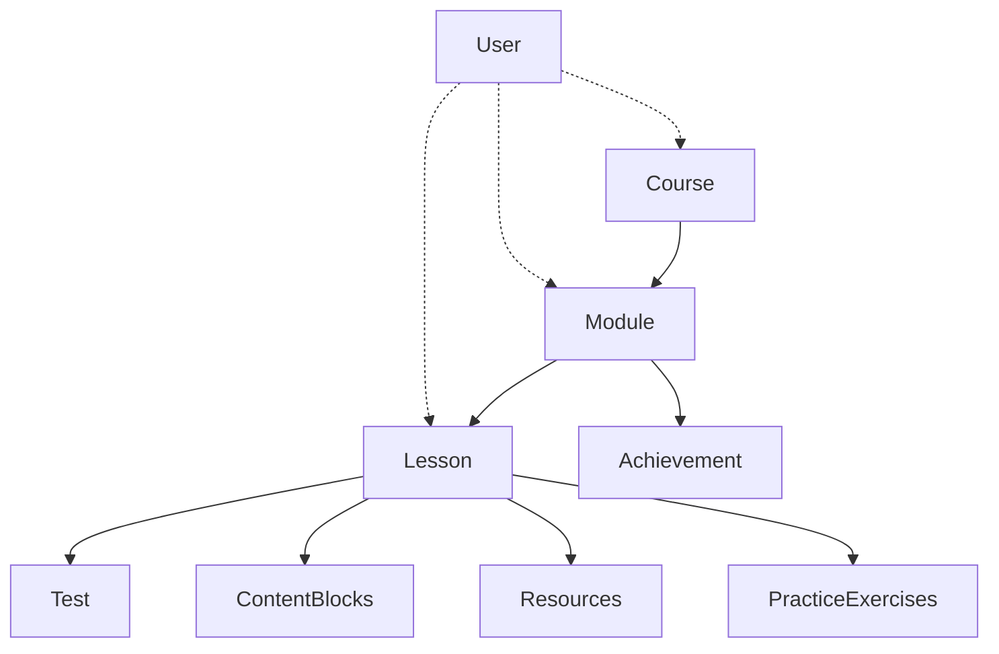

# Схеми створення курсу та уроку

Цей документ містить детальні схеми структур даних та вкладенності для створення курсів та уроків в платформі навчання через MCP (Model Context Protocol) з API токенами.

## 📚 Схема структури Курсу

### JSON структура для створення курсу:

```json
{
  "title": "Назва курсу",
  "description": "Опис курсу",
  "image": "Шлях до зображення курса",
  "videos": ["video_url_1", "video_url_2"],
  "professions": ["професія_1_id", "професія_2_id"], // або [] пустий масив
  "difficulty": "beginner|intermediate|advanced",
  "isDraft": true|false,
  "modules": []
}
```

### Обов'язкові поля:

- ✅ `title` - назва курсу (автоматично генерується slug)
- ✅ `description` - опис курсу
- ✅ `difficulty` - рівень складності

### Опціональні поля:

- 🎥 `videos` - масив URL відео файлів (опціонально)
- 🖼️ `image` - шлях до зображення курсу (за замовчуванням стандартне)
- 👔 `professions` - масив ID професій з мікросервісу (опціонально, можна пустий масив)

### Автоматично заповнювані поля:

- ⏱️ `duration` - тривалість курсу в хвилинах (автоматично розраховується)
- 📅 `createdAt` - дата створення
- 📅 `updatedAt` - дата останнього оновлення
- ⭐ `rating` - рейтинг (за замовчуванням 0)
- 👥 `enrolledStudents` - кількість записаних студентів
- 🔗 `slug` - унікальний URL-ідентифікатор

## 🏗️ Схема структури Модуля

### JSON структура для створення модуля:

```json
{
  "title": "Назва модуля",
  "content": "HTML контент модуля",
  "description": "Опис модуля",
  "videoUrl": "URL відео (опціонально)",
  "previewImage": "URL зображення (опціонально)",
  "lessons": [],
  "courses": ["course_id_1", "course_id_2"],
  "isDraft": true|false
}
```

### Обов'язкові поля:

- ✅ `title` - назва модуля (автоматично генерується slug)
- ✅ `content` - HTML контент модуля

### Опціональні поля:

- 📝 `description` - опис модуля (опціонально)
- 🎥 `videoUrl` - URL відео для модуля (опціонально)
- 🖼️ `previewImage` - URL зображення для модуля (опціонально)
- 📚 `lessons` - масив ID уроків (можна пустий масив)
- 📖 `courses` - масив ID курсів (можна заповнити самостійно через API)
- ⭐ `isDraft` - статус чернетки (за замовчуванням true)

**ВАЖЛИВО:** Модулі НЕ містять тести безпосередньо. Тести прикріплюються до уроків!

### Автоматично заповнювані поля:

- 🔗 `slug` - унікальний URL-ідентифікатор (генерується з назви)
- 📅 `createdAt` - дата створення
- 📅 `updatedAt` - дата останнього оновлення

### Вкладеність в курсі:

```javascript
// У моделі Course модулі зберігаються як масив об'єктів з порядком:
{
  "modules": [
    {
      "module": "ObjectId модуля",  // Посилання на зовнішню колекцію
      "order": 0                   // Порядок у курсі
    }
  ]
}
```

## 📖 Схема структури Уроку

### JSON структура для створення уроку:

```json
{
  "title": "Назва уроку",
  "description": "Опис уроку (опціонально)",
  "content": "Головний контент уроку (HTML/Markdown)",
  "image": "URL зображення уроку (опціонально)",
  "duration": 45,
  "type": "text|video|interactive",
  "contentType": "standard|labyrinth|flippingCards|mixed|memoryGame|tagCloud|rolePlayGame|textReconstruction|presentation|fullHtml|htmlBlock|video",
  "professions": ["profession_id_1", "profession_id_2"],
  "skills": [
    {
      "id": "skill_id",
      "name": "Назва навички",
      "responsibility_id": "resp_id",
      "responsibility_name": "Назва відповідальності",
      "tool_id": "tool_id",
      "tool_name": "Назва інструменту",
      "description": "Опис навички"
    }
  ],
  "contentBlocks": [],
  "videoUrl": "URL відео (для video типу)",
  "tests": ["test_id_1", "test_id_2"],
  "resources": [],
  "practiceExercises": [],
  // instructor автоматично заповнюється з токена або може бути опущено
  "isDraft": true|false
}
```

### Валідація уроку:

| Поле                | Тип      | Обов'язкове   | Валідація                      | Пояснення                                       |
| ------------------- | -------- | ------------- | ------------------------------ | ----------------------------------------------- |
| `title`             | String   | ✅            | trim(), не пустий              | Назва уроку                                     |
| `description`       | String   | ❌            | Опис уроку                     | Короткий опис уроку (опціонально)               |
| `content`           | String   | Conditional\* | Залежить від contentType       | Основний контент                                |
| `image`             | String   | ❌            | URL зображення                 | Зображення уроку (опціонально)                  |
| `duration`          | Number   | ❌            | Хвилини, за замовчуванням 0    | Тривалість для розрахунку                       |
| `type`              | String   | ❌            | enum: text, video, interactive | Тип уроку                                       |
| `contentType`       | String   | ❌            | enum: стандартні типи          | Тип контенту                                    |
| `professions`       | Array    | ❌            | Масив ID професій              | ID професій з libservice (опціонально)          |
| `contentBlocks`     | Array    | Conditional\* | Для mixed типу                 | Блоки контенту                                  |
| `videoUrl`          | String   | ❌            | URL відео                      | Для відео уроків                                |
| `skills`            | Array    | ❌            | Масив навичок                  | ID Навичок з libservice
| `tests`             | Array    | ❌            | Масив ID тестів                | ID тестів для цього уроку (опціонально)         |
| `resources`         | Array    | ❌            | Додаткові ресурси              | Об'єкти з title, type, description, url         |
| `practiceExercises` | Array    | ❌            | Практичні завдання             | Об'єкти з title, description, codeSnippet       |
| `instructor`        | ObjectId | ❌            | Автор уроку                    | Автоматично заповнюється з токена               |
| `isDraft`           | Boolean  | ❌            | Статус публікації              | За замовчуванням true                           |

\*`content` обов'язкове, крім випадків коли `contentType = 'mixed'` і існують `contentBlocks` \*`contentBlocks` обов'язкове, коли `contentType = 'mixed'`

## 🔧 Спеціальні типи контенту

### ContentBlocks - Валідація за типами:

#### FlippingCards:

```json
{
  "type": "flippingCards",
  "content": "[
    {
      \"front\": {
        \"title\": \"Заголовок передньої сторони\",
        \"content\": \"Контент передньої сторони\"
      },
      \"back\": {
        \"title\": \"Заголовок зворотної сторони\",
        \"content\": \"Контент зворотної сторони\"
      }
    }
  ]"
}
```

#### Labyrinth:

```json
{
  "type": "labyrinth",
  "content": "{
    \"startNode\": \"початкова_нода\",
    \"nodes\": [
      {\"id\": \"нода_1\", \"content\": \"контент\", \"choices\": []}
    ]
  }"
}
```

#### Video:

```json
{
  "type": "video",
  "content": "{
    \"videoUrl\": \"https://example.com/video.mp4\"
  }"
}
```

#### Mixed Content:

```json
{
  "contentType": "mixed",
  "contentBlocks": [
    {
      "type": "standard",
      "content": "Стандартний блок",
      "order": 1
    },
    {
      "type": "flippingCards",
      "content": "[\"JSON з картками\"]",
      "order": 2
    }
  ]
}
```

## 🏛️ Структура вкладення в базі даних

### Курс → Модулі → Уроки/Тести:

```
Course (Колекція)
├── _id: ObjectId
├── title: String
├── description: String
├── modules: [
│   ├── module: ObjectId -> Module._id
│   └── order: Number
│   ]
└── ... інші поля Course

Module (Колекція)
├── _id: ObjectId
├── title: String
├── lessons: [
│   └── ObjectId -> Lesson._id
│   ]
└── ... інші поля Module

Lesson (Колекція)
├── _id: ObjectId
├── title: String
├── content: String
├── contentType: String
├── contentBlocks: [Object]
├── tests: [
│   └── ObjectId -> Test._id
│   ]
└── ... інші поля Lesson

Test (Колекція)
├── _id: ObjectId
├── title: String
├── lesson: ObjectId -> Lesson._id
├── questions: [Object]
└── ... інші поля Test
```

## 🚀 Послідовність створення

### 1. Створення уроків:

```javascript
// Спочатку створюємо всі уроки
const lessonIds = [];
for (const lessonData of lessons) {
  const lesson = new Lesson(lessonData);
  await lesson.save();
  lessonIds.push(lesson._id);
}
```

### 2. Створення модуля:

```javascript
// Потім створюємо модуль з посиланнями на уроки
const module = new Module({
  title: "Назва модуля",
  lessons: lessonIds, // Масива ID уроків
  // ... інші поля
});
await module.save();
```

### 3. Створення курсу:

```javascript
// Нарешті додаємо модуль до курсу
const course = new Course({
  title: "Назва курсу",
  modules: [
    {
      module: module._id,
      order: 0,
    },
  ],
  // ... інші поля
});
await course.save();

// Додаю курси до модуля (зворотний зв'язок)
module.courses.push(course._id);
await module.save();
```

## ⚠️ Важливі зауваження

1. **Порядок операцій**: Спочатку уроки → потім модулі → нарешті курси
2. **Автоматичний slug**: Генерується з назви з транслітерацією
3. **Валідація контенту**: Різні типи блоків мають специфічні правила валідації
4. **Зворотні посилання**: При додаванні модуля до курсу автоматично оновлюється поле `courses` в модулі
5. **Драфт статус**: За замовчуванням всі сутності створюються як чернетки (`isDraft: true`)

## 🔗 Діаграма зв'язків



**ВАЖЛИВО:** Тести (Test) прикріплюються до уроків (Lesson), а не до модулів (Module)!

---

## 🔐 API токени та MCP схеми

### Структура API токена:

```json
{
  "token": "унікальний-uuid-токен",
  "name": "Назва токена",
  "description": "Опис токена",
  "permissions": ["course:save", "lesson:save"],
  "createdBy": "ObjectId користувача",
  "isActive": true,
  "createdAt": "дата створення",
  "lastUsedAt": "дата останнього використання"
}
```

### Автозаповнювані поля для MCP API:

Всі сутності, створені через API токен, автоматично отримують:

```json
{
  "updatedViaApi": true,
  "lastApiUpdate": "datetime",
  "apiTokenId": "ObjectId токена"
}
```

## 🌐 MCP API ендпойнти

### Курси через API токен:

#### Авторизація:

```
Header: X-API-Token: ваш-токен-uuid
або
Header: Authorization: Bearer ваш-токен-uuid
```

#### Створення курсу:

```
POST /api-token/courses
Content-Type: application/json
X-API-Token: ваш-токен

{
  "title": "Назва курсу",
  "description": "Опис курсу",
  "difficulty": "beginner|intermediate|advanced",
  "videos": ["url1", "url2"],
  "professions": ["prof_id1", "prof_id2"],
  "image": "path/to/image.jpg",
  "isDraft": false,
  "modules": [
    {
      "id": "module_id_1",
      "order": 0
    },
    {
      "id": "module_id_2",
      "order": 1
    }
  ]
}
```

#### Оновлення курсу:

```
PUT /api-token/courses/:courseId
Content-Type: application/json
X-API-Token: ваш-токен

{
  "_id": "courseId",
  "title": "Оновлена назва курсу",
  "description": "Оновлений опис курсу",
  "difficulty": "intermediate",
  "modules": [
    {
      "id": "module_id_1",
      "order": 0
    }
  ]
}
```

#### Пакетний імпорт курсів:

```
POST /api-token/courses/batch
Content-Type: application/json
X-API-Token: ваш-токен

[
  { "title": "Курс 1", ... },
  { "title": "Курс 2", ... }
]
```

### Модулі через API токен:

#### Створення модуля:

```
POST /api-token/modules
Content-Type: application/json
X-API-Token: ваш-токен

{
  "title": "Назва модуля",
  "content": "HTML контент модуля",
  "description": "Опис модуля",
  "videoUrl": "https://example.com/video.mp4",
  "previewImage": "https://example.com/preview.jpg",
  "lessons": ["lesson_id_1", "lesson_id_2"],
  "courses": ["course_id_1", "course_id_2"],
  "isDraft": false
}
```

**ВАЖЛИВО:** Поле `tests` було видалено з модулів. Тести прикріплюються до уроків!

#### Оновлення модуля:

```
PUT /api-token/modules/:moduleId
Content-Type: application/json
X-API-Token: ваш-токен

{ ті самі поля що й для створення + "_id": "moduleId" }
```

#### Отримання модулів:

```
GET /api-token/modules?page=1&limit=20&search=keyword&courseId=course_id&isDraft=false
```

### Уроки через API токен:

#### Створення уроку:

```
POST /api-token/lessons
Content-Type: application/json
X-API-Token: ваш-токен

{
  "title": "Назва уроку",
  "description": "Опис уроку",
  "content": "Контент уроку",
  "image": "https://example.com/image.jpg",
  "duration": 30,
  "type": "text",
  "contentType": "standard",
  "professions": ["profession_id_1"],
  "skills": [
    {
      "id": "skill_id",
      "name": "Назва навички",
      "responsibility_id": "resp_id",
      "responsibility_name": "Назва відповідальності",
      "tool_id": "tool_id",
      "tool_name": "Назва інструменту",
      "description": "Опис навички"
    }
  ],
  "videoUrl": "https://...",
  "tests": [],
  "resources": [],
  "practiceExercises": [],
  "isDraft": false
}
```

#### Оновлення уроку:

```
PUT /api-token/lessons/:lessonId
Content-Type: application/json
X-API-Token: ваш-токен

{ ті самі поля що й для створення + "_id": "lessonId" }
```

#### Отримання уроків:

```
GET /api-token/lessons?page=1&limit=20&search=keyword&type=text&contentType=standard
```

### Тести через API токен:

#### Створення тесту:

```
POST /api-token/tests
Content-Type: application/json
X-API-Token: ваш-токен

{
  "title": "Назва тесту",
  "description": "Опис тесту",
  "lesson": "lesson_id",
  "courseId": "course_id",
  "passingScore": 70,
  "questions": [
    {
      "question": "Питання тесту",
      "options": ["Варіант 1", "Варіант 2", "Варіант 3"],
      "correctAnswer": 0
    }
  ],
  "timeLimit": 30
}
```

#### Оновлення тесту:

```
PUT /api-token/tests/:testId
Content-Type: application/json
X-API-Token: ваш-токен

{ ті самі поля що й для створення + "_id": "testId" }
```

#### Отримання тестів:

```
GET /api-token/tests?page=1&limit=20&moduleId=module_id&courseId=course_id&passingScore=70
```

## 📋 Особливості MCP API

| Аспект             | MCP API                       |
| ------------------ | ----------------------------- |
| **Авторизація**    | API токен                     |
| **Обмеження**      | Перевірка прав токена         |
| **Автозаповнення** | `instructor` може бути пустим |
| **Статус**         | Контролюється через API       |
| **Відстеження**    | API метаданні                 |

## ⚠️ Важливі особливості MCP API

1. **Автоматичні поля**: Всі записи отримують `updatedViaApi: true` та `apiTokenId`
2. **Обов'язкові поля**: Через API токен поля `instructor` та `author` стають опціональними
3. **Batch операції**: Підтримується пакетне створення/оновлення через `/batch` ендпойнти
4. **Права доступу**: Токен може мати обмежені права доступу через поле `permissions`
5. **Професії**: Автоматично отримуються з мікросервісу бібліотек по ID
6. **Модулі в курсах**: При створенні курсу модулі передаються як масив об'єктів з `id` та `order`
7. **Двосторонні зв'язки**: При додаванні модуля до курсу автоматично оновлюється поле `courses` в модулі
8. **Валідація тестів**: `passingScore` має бути від 0 до 100, `lesson` (ID уроку) обов'язкове, `courseId` опціональне. Тести прикріплюються до уроків!
9. **Пошук по slug**: Модулі можна оновлювати як по ID, так і по slug
10. **Автоматичне відстеження**: Всі операції логуються з метаданими API токена

---

_Документ оновлено: Структури відповідають моделям та маршрутам API токенів_
