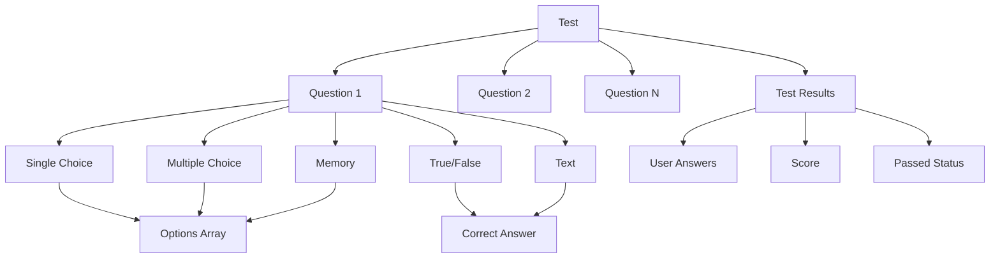

# Схеми створення тестів

Цей документ містить детальні схеми структур даних та валідації для створення тестів в платформі навчання через MCP (Model Context Protocol) з API токенами.

## 📋 Схема структури Тесту

### JSON структура для створення тесту:

```json
{
  "title": "Назва тесту",
  "description": "Опис тесту",
  "module": "module_id",
  "courseId": "course_id",
  "timeLimit": 30,
  "passingScore": 70,
  "attempts": 3,
  "questions": [
    {
      "type": "single-choice",
      "question": "Текст питання",
      "options": [
        {
          "text": "Варіант відповіді 1",
          "isCorrect": true
        },
        {
          "text": "Варіант відповіді 2",
          "isCorrect": false
        }
      ],
      "correctAnswer": "Правильна відповідь (для text, true-false)",
      "points": 1
    }
  ]
}
```

### Обов'язкові поля:

- ✅ `title` - назва тесту
- ✅ `module` - ID модуля, до якого належить тест
- ✅ `passingScore` - прохідний бал (0-100)

### Опціональні поля:

- 📝 `description` - опис тесту
- 🎯 `courseId` - ID курсу (автоматично заповнюється)
- ⏱️ `timeLimit` - обмеження часу в хвилинах (за замовчуванням 30)
- 🔄 `attempts` - кількість спроб (за замовчуванням 3)

### Автоматично заповнювані поля:

- 📅 `createdAt` - дата створення
- 📅 `updatedAt` - дата останнього оновлення
- 🏆 `achievements` - масив досягнень
- 📊 `results` - результати проходження тестів

## 🎯 Типи питань тесту

### 1. Single Choice (Одиночний вибір)

```json
{
  "type": "single-choice",
  "question": "Яка столиця України?",
  "options": [
    {
      "text": "Київ",
      "isCorrect": true
    },
    {
      "text": "Львів",
      "isCorrect": false
    },
    {
      "text": "Харків",
      "isCorrect": false
    },
    {
      "text": "Одеса",
      "isCorrect": false
    }
  ],
  "points": 1
}
```

**Валідація:**

- Має бути рівно один правильний варіант (`isCorrect: true`)
- Мінімум 2 варіанти відповіді
- Максимум 10 варіантів відповіді

### 2. Multiple Choice (Множинний вибір)

```json
{
  "type": "multiple-choice",
  "question": "Які з наведених міст є столицями?",
  "options": [
    {
      "text": "Київ",
      "isCorrect": true
    },
    {
      "text": "Лондон",
      "isCorrect": true
    },
    {
      "text": "Львів",
      "isCorrect": false
    },
    {
      "text": "Париж",
      "isCorrect": true
    }
  ],
  "points": 2
}
```

**Валідація:**

- Мінімум 2 правильні варіанти
- Мінімум 3 варіанти відповіді загалом
- Максимум 10 варіантів відповіді

### 3. True/False (Правда/Неправда)

```json
{
  "type": "true-false",
  "question": "Київ є столицею України",
  "options": [],
  "correctAnswer": "true",
  "points": 1
}
```

**Валідація:**

- `correctAnswer` має бути "true" або "false"
- `options` має бути порожнім масивом `[]`
- Підтримка нормалізації: "1"/"0", "Да"/"Нет", "true"/"false"

### 4. Text (Текстова відповідь)

```json
{
  "type": "text",
  "question": "Назвіть столицю України",
  "options": [],
  "correctAnswer": "Київ",
  "points": 1
}
```

**Валідація:**

- `correctAnswer` обов'язкове
- `options` має бути порожнім масивом `[]`
- Порівняння без урахування регістру та пробілів
- Точне збігання тексту

### 5. Memory (Пам'ять - знаходження пар)

```json
{
  "type": "memory",
  "question": "Знайдіть відповідні пари",
  "options": [
    {
      "text": "Київ",
      "pairId": "pair1"
    },
    {
      "text": "Україна",
      "pairId": "pair1"
    },
    {
      "text": "Лондон",
      "pairId": "pair2"
    },
    {
      "text": "Великобританія",
      "pairId": "pair2"
    }
  ],
  "points": 2
}
```

**Валідація:**

- Кожен елемент має унікальний `pairId`
- Парна кількість елементів
- Мінімум 2 пари, максимум 10 пар
- Для різних двох об'єктів має бути однакова пара ID

## 🔧 Валідація питань

| Поле            | Тип    | Обов'язкове   | Валідація                     | Пояснення                   |
| --------------- | ------ | ------------- | ----------------------------- | --------------------------- |
| `type`          | String | ✅            | enum: 5 типів                 | Тип питання                 |
| `question`      | String | ✅            | trim(), не пустий             | Текст питання               |
| `options`       | Array  | Conditional\* | Залежить від типу             | Варіанти відповіді          |
| `correctAnswer` | String | Conditional\* | Залежить від типу             | Правильна відповідь         |
| `points`        | Number | ❌            | Мінімум 1, за замовчуванням 1 | Бали за правильну відповідь |

_`options` обов'язкове для single-choice, multiple-choice, memory (порожній масив для true-false, text)
_`correctAnswer` обов'язкове для true-false, text

## 📊 Валідація тесту

| Поле           | Тип      | Обов'язкове | Валідація                     | Пояснення       |
| -------------- | -------- | ----------- | ----------------------------- | --------------- |
| `title`        | String   | ✅          | trim(), не пустий             | Назва тесту     |
| `description`  | String   | ❌          | Опис тесту                    | Детальний опис  |
| `module`       | ObjectId | ✅          | Існуючий модуль               | ID модуля       |
| `courseId`     | ObjectId | ❌          | Існуючий курс                 | ID курсу        |
| `timeLimit`    | Number   | ❌          | Хвилини, за замовчуванням 30  | Обмеження часу  |
| `passingScore` | Number   | ✅          | 0-100                         | Прохідний бал   |
| `attempts`     | Number   | ❌          | Мінімум 1, за замовчуванням 3 | Кількість спроб |
| `questions`    | Array    | ✅          | Мінімум 1 питання             | Масив питань    |

## 🚀 Послідовність створення тесту

### 1. Створення тесту через API токен:

```javascript
// Спочатку створюємо тест
const testData = {
  title: "Тест з основ програмування",
  description: "Перевірка знань основ JavaScript",
  module: "module_id",
  courseId: "course_id",
  timeLimit: 45,
  passingScore: 70,
  attempts: 3,
  questions: [
    {
      type: "single-choice",
      question: "Що таке змінна в JavaScript?",
      options: [
        { text: "Контейнер для зберігання даних", isCorrect: true },
        { text: "Функція", isCorrect: false },
        { text: "Об'єкт", isCorrect: false },
      ],
      points: 1,
    },
    {
      type: "multiple-choice",
      question: "Які з наведених є типами даних в JavaScript?",
      options: [
        { text: "string", isCorrect: true },
        { text: "number", isCorrect: true },
        { text: "boolean", isCorrect: true },
        { text: "function", isCorrect: false },
      ],
      points: 2,
    },
    {
      type: "true-false",
      question: "JavaScript є мовою програмування",
      correctAnswer: "true",
      points: 1,
    },
    {
      type: "text",
      question: "Яка команда використовується для виведення в консоль?",
      correctAnswer: "console.log",
      points: 1,
    },
    {
      type: "memory",
      question: "Знайдіть відповідні пари мова-тип",
      options: [
        { text: "JavaScript", pairId: "pair1" },
        { text: "Динамічна", pairId: "pair1" },
        { text: "Python", pairId: "pair2" },
        { text: "Інтерпретована", pairId: "pair2" },
      ],
      points: 2,
    },
  ],
};

const test = new Test(testData);
await test.save();
```

### 2. Додавання тесту до модуля:

```javascript
// Оновлюємо модуль, додаючи тест
const module = await Module.findById(moduleId);
module.tests.push(test._id);
await module.save();
```

## 🌐 MCP API ендпойнти для тестів

### Створення тесту:

```
POST /api-token/tests
Content-Type: application/json
X-API-Token: ваш-токен

{
  "title": "Назва тесту",
  "description": "Опис тесту",
  "module": "module_id",
  "courseId": "course_id",
  "timeLimit": 30,
  "passingScore": 70,
  "attempts": 3,
  "questions": [
    {
      "type": "single-choice",
      "question": "Питання тесту",
      "options": [
        {
          "text": "Варіант 1",
          "isCorrect": true
        },
        {
          "text": "Варіант 2",
          "isCorrect": false
        }
      ],
      "points": 1
    }
  ]
}
```

### Оновлення тесту:

```
PUT /api-token/tests/:testId
Content-Type: application/json
X-API-Token: ваш-токен

{ ті самі поля що й для створення + "_id": "testId" }
```

### Отримання тестів:

```
GET /api-token/tests?page=1&limit=20&moduleId=module_id&courseId=course_id&passingScore=70
```

## 📋 Особливості MCP API для тестів

| Аспект               | MCP API                           |
| -------------------- | --------------------------------- |
| **Авторизація**      | API токен                         |
| **Обмеження**        | Перевірка прав токена             |
| **Валідація**        | `passingScore` 0-100              |
| **Обов'язкові поля** | `title`, `module`, `passingScore` |
| **Автозаповнення**   | `courseId`, `moduleId`            |
| **Статус**           | Контролюється через API           |
| **Відстеження**      | API метаданні                     |

## ⚠️ Важливі особливості тестів

1. **Типи питань**: Підтримуються 5 типів з різною логікою валідації
2. **Бали**: Кожне питання має власні бали, загальний бал розраховується автоматично
3. **Прохідний бал**: Відсоток від загальної кількості балів
4. **Спроб**: Обмежена кількість спроб проходження
5. **Час**: Обмеження часу на проходження тесту
6. **Результати**: Автоматичне збереження результатів з деталями
7. **Memory тести**: Спеціальна логіка для знаходження пар з `pairId`
8. **True-False та Text**: Використовують `correctAnswer` та порожній масив `options: []`
9. **Нормалізація**: Підтримка різних форматів відповідей (true/false, 1/0, Да/Нет)
10. **API токени**: Автоматичне відстеження створення через API

## 🔗 Діаграма структури тесту



---

_Документ оновлено: Структури відповідають моделям та маршрутам API токенів для тестів_
